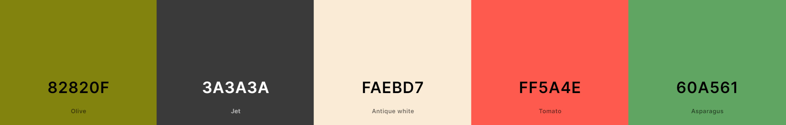

# Mushroom Quiz

## Project Overview
Mushroom Quiz is an online quiz designed for mushroom enthusiasts or anyone who want to test their knowledge of various mushrooms. 

It offers it’s users to explore challenging questions related to the fascinating world of mushrooms.

This website caters to mushroom enthusiasts of all ages, featuring questions about a variety of mushrooms and their features. 

It aims to spark curiosity about the different types of mushrooms and their characteristics and in that way make people want to explore more about those amazing creatures.

You can visit the Live Website [here](https://evondrus.github.io/MushroomQuiz/)

You can visit the GitHub Repository [here](https://github.com/EVondrus/MushroomQuiz.git)

### Table of Contents

  [Site Owner Goals](#site-owner-goals)
  * [User Stories](#user-stories)
    + [First Time User](#first-time-user)
    + [Returning User](#returning-user)
    + [Frequent User](#frequent-user)
  * [Design](#design)
    + [Imagery](#imagery)
    + [Colour scheme](#colour-scheme)
    + [Typography](#typography)
    + [Layout](#layout)
    + [Wireframes](#wireframes)
  * [Features](#features)
    + [Home Page](#home-page)
    + [Info Box](#info-box)
    + [Quiz Box](#quiz-box)
    + [Result Box](#result-box)
    + [General Features](#general-features)
    + [Future Implementations](#future-implementations)
  * [Testing](#testing)
    + [Validator Testing](#validator-testing)
      - [HTML](#html)
      - [CSS](#css)
      - [Javascript](#javascript)
    + [Accessibility](#accessibility)
    + [Button Testing](#button-testing)
    + [Game Testing](#game-testing)
    + [Browser Testing](#browser-testing)
    + [Device Testing](#device-testing)
    + [Fixed Bugs](#fixed-bugs)
    + [Known Bugs](#known-bugs)
  * [Technologies](#technologies)
    + [Languages](#languages)
    + [Libraries and Programs Used](#libraries-and-programs-used)
  * [Deployment](#deployment)
  * [Cloning](#cloning)
  * [Credits](#credits)
    + [Content](#content)
    + [Media](#media)
    + [Resources Used](#resources-used)
  * [Acknowledgements](#acknowledgements)
<small><i><a href='http://ecotrust-canada.github.io/markdown-toc/'>Table of contents generated with markdown-toc</a></i></small>

## Site Owner Goals

- Deliver an engaging quiz experience that combines fun and educational content about mushrooms, fostering curiosity and learning among users.

- Ensure the quiz interface is visually appealing and accessible and responsive across various devices.

- Instill a sense of urgency within users to complete the quiz quickly, motivating them to test their knowledge and improve their performance with each attempt.

## User Stories

### First Time User
- I want to test my knowledge about different mushroom species and their features.
- I hope to navigate the quiz effortlessly, understanding its features and presented information.
- I desire a dynamic and enjoyable experience, whether I'm tackling the quiz alone or sharing the excitement with friends.

### Returning User
- As a returning user, I want to quickly jump back into the quiz without any hassle, picking up where I left off.
- I hope to encounter new questions or randomized sequences to keep the quiz fresh and engaging each time.

### Frequent User
- I look forward to future implementations, such as username input for saving scores and difficulty levels which would add an extra layer of engagement to the quiz experience.

## Design

### Imagery
- In this imaginative world, the background image boasts an antique white hue adorned with charming, cartoon-style illustrations of diverse mushroom varieties, creating a whimsical atmosphere.
- In the result box, a charming image featuring a large, cheerful mushroom accompanied by two smaller, equally adorable companions. Their lively antics and cute expressions bring an extra layer of delight to the experience.

### Colour scheme

I designed the colour palette for the website myself using [Coolors](https://coolors.co/)

- The colour scheme for the Mushroom Quiz incorporates playful hues of green, red and antique white, inspired by the whimsical imagery of the mushroom world.
- These vibrant tones aim to create a cheerful and inviting atmosphere suitable for users of all ages.
- To ensure coherence and visual harmony, the color picker Chrome extension was utilized to extract the main colours from the background imagery, resulting in the creation of the curated colour palette displayed above.
- Accessibility considerations were paramount during the design process, with careful attention paid to establishing clear contrast between background colours and text elements. 

 ### Typography

 The site uses two primary fonts: "Actor" for body text and "Salsa" for headings and buttons.

I used [Google Fonts](https://fonts.google.com/) to import the following:

- "Actor" offers a modern look, enhancing readability across devices.
- "Salsa" adds a touch of whimsy, aligning with the playful theme of the quiz.

Sans Serif is used as a backup font, in case for any reason the main font isn't being imported into the site correctly.

### Layout
The site is a single page with 4 sections:
  - Start area
  - Info Box
  - Quiz Box
  - Result Box

### Wireframes
I created these wireframes using Balsamiq.

Wireframe

 

## Features

### Home Page
- The start page of the Mushroom Quiz welcomes users with a vibrant title "Mushroom Quiz" set against an antique white background adorned with charmingly drawn cartoon mushrooms.
- A prominent "Start Quiz" button invites users of all ages to embark on their journey through the enchanting world of mushroom trivia and fun.
- A minimalistic footer containing a copyright notice with my name and a heartfelt thank you for playing the game.

### Info Box
- The Info Box on the Mushroom Quiz page serves as a guide, presenting the rules of the game in a friendly and engaging manner.
- Users are encouraged to proceed with confidence and embrace the challenge ahead with a "Continue" button.
- Users do have "Exit" button option to go back to the start page.

### Quiz Box
The Quiz Box component comprises three main sections: Header, Section, and Footer.

- Header
  - The header section displays the current question number and total questions, providing users with a sense of progress
  - Featuring a timer showing the remaining time to answer each question.
  - The animated timer adds a sense of urgency, keeping participants on their toes as they race against the clock to select the correct answers.
  - An animated timeline enhances the visual appeal and adds dynamism to the Quiz Box.

- Section
  - Users encounter the question along with multiple answer options. 
  - Answer options are presented as interactive buttons, allowing users to make their selections seamlessly.
  - Upon selecting an answer, clear and distinct color is presented to inform the user wether their choice was correct. 
  - Additionally a shake animation is added to the incorrect answers and the timer stops upon clicking the answer.

- Footer
  - The footer showcases the current score, displaying the number of correct and incorrect answers. 
  - This feedback mechanism provides users with real-time insights into their performance, enhancing the overall gaming experience.

### Result Box

 - Upon completing the assessment, the user will be presented with a comprehensive screen showcasing their total score, accompanied by a personalized feedback message that adjusts based on the number of correctly answered questions.

 

### General Features

The website ensures a responsive design and includes:
- Favicon
  - Selected to align with the overall theme.
  
  

- 404 - Page not found
  - A custom 404 page is a helpful feature that provides users with a more engaging and informative experience when they land on a non-existent page or encounter broken links within the application.

  

### Future Implementations

Ideas for future implementations I would like to include are:

- Quiz Difficulty Levels: Adding versatility to the quiz experience.

- Username and Leaderboard: A feature to request usernames and provide users with a table of highest scores for the users to compare and compete with.

- Multi-player:  Engage in head-to-head competition with friends or fellow participants remotely, each playing from their own devices.

-  Add sound effects 
    - To the correct and incorrect answers.
    - When the result page is displayed.

## Testing

### Validator Testing
- #### HTML
    - No errors were returned when passing through the official W3C Markup Validator
        - [W3C Validator Results](https://validator.w3.org/nu/?showsource=yes&doc=https%3A%2F%2Fevondrus.github.io%2FMushroomQuiz%2F)
- #### CSS
    - No errors were found when passing through the official W3C CSS Validator 
        - [W3C CSS Validator Results](https://jigsaw.w3.org/css-validator/validator?uri=https%3A%2F%2Fevondrus.github.io%2FMushroomQuiz%2F&profile=css3svg&usermedium=all&warning=1&vextwarning=&lang=sv)
- #### Javascript
    - No errors or warnings were returned when passing through the the  [JSHint Validator](https://jshint.com/)

  
  

### Accessibility

- The website scored 100% on Lighthouse accessibility tests for both mobile and desktop versions. This indicates that the selected colors and fonts are easy to read and accessible to all users.

### Button Testing
- All buttons, including answer buttons, were manually tested to ensure proper navigation and functionality.

### Game Testing
Conduct a thorough review with friends and family to validate functionality and user experience

- Ensure that questions and answers are shuffled randomly to prevent predictability.

- Verify that the timer functionality halts correctly upon user interaction, ensuring accurate time management during gameplay.

- Check for clear indication of the current question being displayed.

- Test the efficacy of visual cues such as color changes and shake animations to provide intuitive feedback to the player

- Validate the accuracy of score tracking mechanisms, including the proper incrementation of incorrect scores when no answer is selected

### Browser Testing
- The Website was tested on Google Chrome and Firefox with no issues noted.

### Device Testing
- The website was tested devices including Desktops, Laptops, iPhone 8, iPhone 11 Pro Max and Xiaomi Redmi Note 11 to ensure responsiveness across different screen sizes in both portrait and landscape orientations. 

- Additionally, compatibility was verified using Chrome developer tools across various devices, ensuring structural integrity across different screen sizes.

- I also used the following website to test responsiveness:
    - [Responsinator](http://www.responsinator.com/?url=evondrus.github.io%2FMushroomQuiz%2F)

### Fixed Bugs
- The score was not incremented for an incorrect answer if the user didn't select an answer and the next question was displayed.
- Adjusted the showNextQuestion function to correctly increment the score for an incorrect answer even if the user didn't select an option.

### Known Bugs
 - An alert message intended to notify users in case of malfunction within the code may not display the custom message as expected.

## Technologies 

### Languages

The languages used for the website include:
- HTML5
- CSS3
- JavaScript

### Libraries and Programs Used

- [Am I Responsive](http://ami.responsivedesign.is/) - Verify website responsiveness on various devices.
- [Responsinator](http://www.responsinator.com/) - Check responsiveness on different devices.
- [Balsamiq](https://balsamiq.com/) - Generate wireframe images.
- [Chrome Dev Tools](https://developer.chrome.com/docs/devtools/) - Development, testing, and performance optimization.
- [Font Awesome](https://fontawesome.com/) - Social media icons in the footer.
- [GitHub](https://github.com/) - Version control and hosting.
- [Google Fonts](https://fonts.google.com/) - Import and alter fonts on the page.
- [TinyPNG](https://tinypng.com/) - Compress images without a reduction in quality.
- [W3C](https://www.w3.org/) - HTML & CSS Validation.
- [PyhtonTutor](https://pythontutor.com/javascript.html#mode=edit) - JavaScript compiler, visual debugger, and AI tutor.

## Deployment

The site was deployed using GitHub pages. The steps to deploy using GitHub pages are:

1. Go to the repository on GitHub.com
2. Select **'Settings'** near the top of the page.
3. Select **'Pages'** from the menu bar on the left of the page.
4. Under **'Source'** select the 'Branch' dropdown menu and select the main branch.
5. Once selected, click the **'Save'**.
6. Deployment should be confirmed by a message on a green background saying "Your site is published at" followed by the web address.

The live link can be found here - [Mushroom Quiz](https://evondrus.github.io/MushroomQuiz/)

## Cloning

To clone this repository follow the below steps: 

1. Locate the repository at this link [Mushroom Quiz Repository](https://github.com/EVondrus/MushroomQuiz.git). 
2. Under **'Code'**, see the different cloning options, HTTPS, SSH, and GitHub CLI. Click the prefered cloning option, and then copy the link provided. 
3. Open **Terminal**.
4. In Terminal, change the current working directory to the desired location of the cloned directory.
5. Type **'git clone'**, and then paste the URL copied from GitHub earlier. 
6. Type **'Enter'** to create the local clone. 

## Credits

### Content
The content of this quiz draws inspiration from the shared interests and expertise of my partner, stemming from a passion for mushrooms and cultivation methods. Together we came up with the questions and answer options for this quiz.

### Media

I'd like to extend my gratitude to the talented artists below for their fantastic work!

Background image:
- [Freepik](https://www.freepik.com/free-vector/engraving-hand-drawn-mushroom-pattern_13380758.htm) - Hand drawn mushroom pattern.

Mushroom icon created by:
- [Rabbixcons - Flaticon](https://www.flaticon.com/free-icon/mushrooms_2541502) - One happy mushroom and two small firends.

Mushroom image on 404 - Page:
- [brgfx - Freepik](https://www.freepik.com/free-vector/single-mushroom-with-face_20438965.htm#page=4&query=walking%20mushroom&position=11&from_view=search&track=ais&uuid=fe5c4d05-9104-4479-9a7d-052ff55d27ef) - Single mushroom with surpriced face.

### Resources Used
- [W3Schools](https://www.w3schools.com/)
- [Stack Overflow](https://stackoverflow.com/)
- [Code Institute](https://codeinstitute.net/)

- The inspiration on how to build my quiz game with a time line function - [Ali Aslan](https://youtu.be/xZXW5SnCiWI?si=8x6uHC6c0aDeOr9G)
- I used [GreatStack tutorial](https://youtu.be/PBcqGxrr9g8?si=PdMjxquI5jLCETur) to acquire proficiency in integrating questions and answers dynamically into HTML elements using JavaScript.
- I used the Fisher Yates Shuffle in order to shuffle the questions and answers which I learned about in this tutorial - [Shuffle an array](https://javascript.info/task/shuffle)
- My mentor, Antonio Rodriquez, explained about the setTimeout method.
- The shake animation effect for incorrect answer selection came from [Dane Parchment](https://teamtreehouse.com/community/shake-effect-with-javascript-only).

## Acknowledgements

Special thanks to my mentor, Antonio, for his guidance and support.

I'm also grateful to the Code Institute Slack community for their helpful and quick feedback!